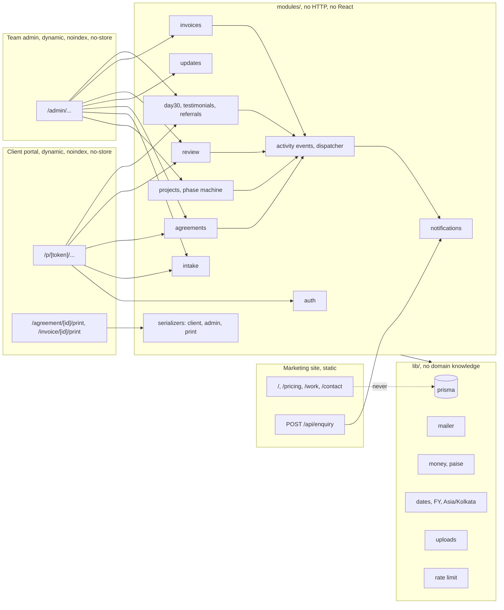

# Architecture

Drafted 7 Sep 2026, before the code; last checked against it on 7 Sep 2026 after step 5. The build session keeps this file true: a structural change without a matching edit here, and an ADR in `docs/adr/`, is not done. Read with `DFD.md` (what flows), `DATA-MODEL.md` (what is stored), `SEQUENCES.md` (what order things happen in).

## The shape in one paragraph

One Next.js application, one MySQL database, one upload directory, on one domain. Three zones share one design system and one codebase and nothing else: the marketing site is static and never touches the database; the client portal is dynamic, unindexed and reached only by link plus code; the admin is dynamic, unindexed and reached by password. All business behaviour lives in domain modules that know nothing about HTTP; route handlers validate input, call a module, and render a view. Every meaningful change writes an activity event, and everything that notifies anyone listens to those events rather than being called from the place the change happened. That last sentence is what leaves room for later features.

## Zones and boundaries



Rules that follow. A route file never imports `prisma` directly; it imports a module. A module never imports from `app/` or renders anything. A view never receives a Prisma model; it receives the output of a serializer. `lib/` has no idea what a project is. Tests for the domain run without a browser and without HTTP.

## Folder layout

The scaffold already uses `src/`, so everything application-side lives under it. `src/components/` and `src/lib/intake/` from the front half stay where they are; the domain modules are added beside them and the front-half logic migrates into them step by step, in the step that next touches each area.

```
src/app/                 routes only: validate, call a module, render
  (site)/                static marketing pages
  p/[token]/             client portal screens
  admin/                 team screens
  agreement/[id]/print   print views
  invoice/[id]/print
  api/                   the few JSON endpoints (enquiry, code request, code verify)
src/components/          React only, grouped by zone: marketing, portal, admin, intake
src/modules/             domain, one folder per bounded area, no HTTP, no React
  auth/                  tokens, codes, sessions, admin passwords
  projects/              project CRUD, phase.ts (the transition table), needs-attention
  intake/                importer, validation per document version, answers, uploads
  agreements/            versions, notes, sign-off
  updates/
  review/                rounds, delivery sign-off, thanks page writes
  invoices/              numbering, issue, mark paid, words-from-figures
  day30/                 unlock, metric, testimonials, referrals
  notifications/         templates (email, WhatsApp text), subscribers
  events/                activity_event writer and the in-process dispatcher
  serializers/           toClientView, toAdminView, toPrintView per entity
src/lib/                 prisma client wrapper, mailer, money, dates, files, rate limit, logger
src/generated/           Prisma client output, gitignored
prisma/                  schema, migrations, seed
scripts/                 seed, admin creation, migrate-if-configured
tests/                   unit (vitest) and e2e (playwright)
docs/                    this folder
```

## The seams where new features attach

Each is a named place. Adding the feature means adding at that seam, not opening a route handler.

- **A new step in the client journey.** Add a phase to the enum, a row to the transition table in `modules/projects/phase.ts`, a screen under `app/p/[token]/`, and a case in the project page's phase switch. The journey is data in one file, not a chain of `if` statements across screens.
- **A new side effect of an existing step** (a Slack message, a calendar hold, a CRM row). Subscribe to the activity event in `modules/notifications/subscribers.ts`. Nothing in the module that raised the event changes.
- **A new mail transport.** `lib/mail` chooses between SMTP and a log writer from `MAIL_TRANSPORT` and `SMTP_HOST`. A production process with neither refuses to send rather than dropping mail silently; the end to end suite sets `MAIL_TRANSPORT=log` so a production build can run without a mailbox.
- **A new notification channel.** A new sender in `modules/notifications/channels/` that takes the same rendered template. Email exists; WhatsApp is prefilled links today and becomes a sender here if an API is ever used.
- **A new invoice kind, or a payment gateway.** `modules/invoices` owns numbering and issue; a gateway would add a `payment` table and a subscriber on `invoice.issued` that creates a payment link, and a webhook route that calls `invoices.markPaid`. Numbering does not change.
- **A new questionnaire field type or document version.** `modules/intake/versions/v1.ts` holds the validator and renderer registry for version 1; version 2 is a sibling file, and the importer picks by `document.version`. Old intakes keep rendering with their own version.
- **Multi-currency.** A `currency` column on `agreement` and `invoice`, `lib/money` gaining a formatter per currency, and the words-from-figures function per currency. Paise stays the unit for INR; minor units for others. No screen changes.
- **Roles.** A `role` column on `admin_user` and one guard function in `modules/auth/authorize.ts` that every admin action already calls with `"admin"`. Today it returns true for both founders.
- **The referral becoming a programme.** Rewards and tracking codes attach to the existing `referral` row and a subscriber on `enquiry.received`; the thank-you page does not change.
- **A second client contact.** `client` already separates the day-to-day contact from the sign-off person; a `client_contact` table can replace those columns later with one serializer edit.
- **Settings.** `setting` is a typed key-value table read through `modules/settings/get(key)`; a new setting is a new key with a default, no migration.

## Principles applied, and where they were deliberately not

- **Domain modules, thin routes.** Applied everywhere. The cost is a few more files; the return is that the phase rules and money rules are testable without a browser and cannot be bypassed by a new screen.
- **Explicit state machine.** Applied to `project.phase`. Not applied to invoice status or review outcome, which have two or three states each and one writer; a transition table there would be ceremony.
- **Events for side effects.** Applied. Kept in-process (a function call, not a queue), because a queue on a single Hostinger node is a second system to run for no benefit at this scale. The dispatcher's interface is the seam if a queue is ever needed.
- **Append-only evidence.** Applied to sign-offs, review rounds, issued invoices, agreement notes. Not applied to the `referral` row (a third party's details; admin can delete) or to drafts (agreements before `agreed_at`, updates before send).
- **Serializers per audience.** Applied, because the one leak that matters (internal cost) has to be impossible rather than avoided.
- **Validation at the boundary.** Every request body and every uploaded JSON goes through a zod schema before a module sees it.
- **Migrations, additive only in production.** A destructive migration needs an ADR and a backup step in `DEPLOY.md`.
- **Not applied:** microservices, a message queue, a separate API server, GraphQL, an ORM-independent repository layer, feature flags beyond a boolean setting where a screen is being trialled, and any abstraction that exists for a future that has not been asked for. Two founders and one node; the architecture matches the team.

## Quality gates

- CI on every push (GitHub Actions): lint, typecheck, unit tests, e2e tests against a MySQL service container. Deployment requires green.
- A "leak walk" test: for the seed project, request every client and print route and assert none of the bodies contain `internal_cost_paise`, `internal_notes`, `friction_notes`, or a referral contact.
- A phase test: every transition in the table has a test that it works, and every transition not in the table has a test that it is refused.
- A numbering test: twenty invoices issued in parallel produce twenty consecutive numbers.
- `/healthz` returns database status for Hostinger's monitor; structured logs with a request id (pino); an error page that says what to do and shows no stack.

## Operations, in short

Backups: nightly `mysqldump` (in `DEPLOY.md`) plus Hostinger's own. Restore is a runbook entry, tested once before launch. Uploads live outside the web root under `UPLOAD_DIR` and are part of the backup. Rotating a client's link, recording a WhatsApp sign-off, cancelling a project and marking an invoice paid are all admin actions with a runbook line each in `docs/RUNBOOK.md`, which the build session writes in step 11.
