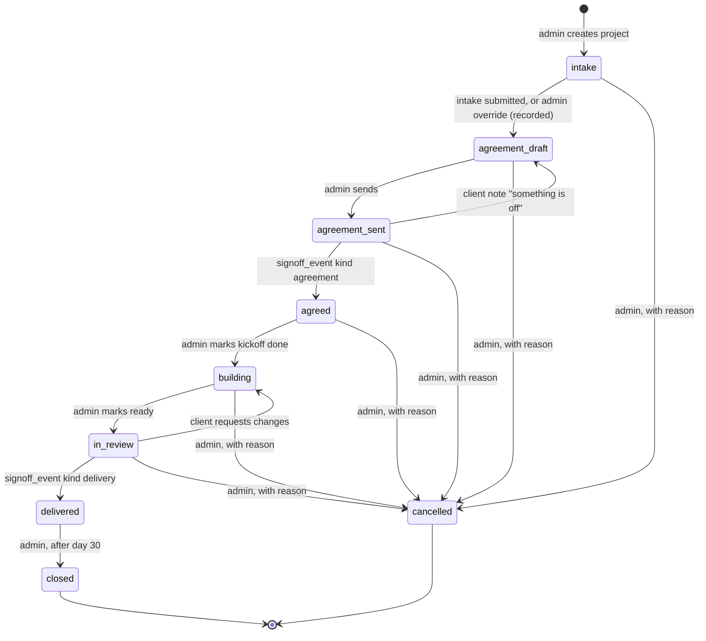

# Data model

Drafted 7 Sep 2026, last checked against the code on 14 Sep 2026, after ADR 0021. The entity list is PORTAL-SPEC §4 and INTAKE-SPEC §12 plus the tables added by CLAUDE.md §5 and §11. Field detail stays in the specs; this file shows shape, relationships and the rules the schema must enforce. The Prisma schema is derived from this, and this file is updated in the same commit as any migration.

## Entity relationship diagram

```mermaid
erDiagram
  company ||--o{ setting : "has"
  admin_user ||--o{ admin_session : "opens"
  client ||--o{ project : "owns"
  project ||--o| agreement : "has one"
  project ||--o{ agreement_note : "receives"
  project ||--o{ signoff_event : "records"
  project ||--o{ update : "gets weekly"
  project ||--o{ review_round : "goes through"
  project ||--o{ invoice : "is billed by"
  project ||--o| day30 : "unlocks"
  project ||--o{ testimonial : "collects"
  project ||--o{ referral : "collects"
  project ||--o| intake : "has one"
  project ||--o{ one_time_code : "issues"
  project ||--o{ client_session : "opens"
  project ||--o{ activity_event : "emits"
  intake ||--o{ intake_file : "stores"
  client ||--o{ intake_version : "every sending"
  client ||--o{ intake_change_request : "asked, opened, declined, sent"
  image_library ||--o{ intake : "referenced by image_choice"
  invoice_sequence ||--o{ invoice : "numbers"

  company {
    string name
    string invoice_prefix
    string gstin "nullable"
    string booking_url "nullable"
    int default_advance_pct
    string bank_fields "name, account name, number, IFSC, UPI"
  }
  setting {
    string key PK
    string value
    string type "bool | int | string | json"
  }
  admin_user {
    string email PK
    string password_hash "bcrypt, null until the setup link is used"
    string setup_token_hash
    datetime setup_expires_at
    datetime setup_link_used_at
  }
  client {
    id id PK
    string business_name
    string location "nullable"
    string contact_name
    string contact_phone
    string contact_email
  }
  project {
    id id PK
    id client_id FK
    string name
    string slug
    string type_of_work
    enum phase "intake, agreement_draft, agreement_sent, agreed, building, in_review, delivered, closed, cancelled"
    string signoff_person_name "who says yes on THIS project"
    string signoff_person_email "where the six digit code goes"
    string proposed_signoff_email "what the client typed, until admin confirms"
    string access_token_hash
    datetime token_created_at
    datetime token_rotated_at
    datetime link_emailed_at
    string link_email_error "nullable, shown with a retry"
    int week_count
    string metric_name
    string metric_baseline_value
    enum after_delivery "retainer, handover, undecided"
    datetime delivered_at
    string cancel_reason "nullable"
    datetime expected_by "nullable, the date the client's page shows"
    datetime last_moved_at "nullable, when the phase last changed"
  }
  agreement {
    id id PK
    id project_id FK
    text scope
    json deliverables "key, text, how_to_check"
    text not_included
    date start_date
    date launch_target_date
    json milestones "label, date"
    bigint total_paise
    int advance_pct
    bigint internal_cost_paise "ADMIN ONLY"
    text internal_notes "ADMIN ONLY"
    datetime sent_at
    datetime agreed_at
    string agreed_by_name
    enum agreed_method "portal, whatsapp"
    int version
  }
  agreement_note {
    id id PK
    id project_id FK
    int agreement_version
    text text
    datetime created_at
  }
  signoff_event {
    id id PK
    id project_id FK
    enum kind "agreement, delivery"
    datetime occurred_at
    enum method "portal, whatsapp"
    string actor_name
    string ip "null for whatsapp"
    text raw_note "whatsapp only"
    int agreement_version
  }
  update {
    id id PK
    id project_id FK
    int week_number "unique per project"
    datetime sent_at "null while a draft; set once, then frozen"
    text moved
    text next_up
    text need_from_you
    date need_by_date
    text risks
    string staging_url
  }
  review_round {
    id id PK
    id project_id FK
    int round_number
    datetime sent_at
    string finished_work_url "NOT NULL, see below"
    text client_note
    datetime responded_at
    enum outcome "open, changes_requested, accepted"
  }
  invoice {
    id id PK
    id project_id FK
    enum kind "advance, balance, other"
    string number "AWTM/26-27/007"
    datetime issued_at
    bigint amount_paise
    bigint tax_amount_paise
    bigint total_paise
    enum status "issued, paid, cancelled"
    datetime paid_at
    string paid_reference
  }
  invoice_sequence {
    string prefix PK
    string fy PK
    int last_seq
  }
  day30 {
    id id PK
    id project_id FK
    datetime unlocks_at
    datetime opened_at
    string metric_after_value
    text friction_notes "ADMIN ONLY"
  }
  testimonial {
    id id PK
    id project_id FK
    enum moment "delivery, day30"
    text text
    bool use_name
    bool use_logo
    enum status "draft, approved"
    datetime approved_at
    enum approved_method "portal, whatsapp"
  }
  referral {
    id id PK
    id project_id FK
    string name
    string contact
    datetime created_at
  }
  intake {
    id id PK
    id project_id FK
    json document "the questionnaire, version 1"
    json answers "keyed by question key, with entered_by"
    datetime submitted_at
    bool overridden
  }
  intake_file {
    id id PK
    id intake_id FK
    string question_key
    string stored_path "under UPLOAD_DIR"
    string mime
    int bytes
  }
  intake_version {
    id id PK
    id client_id FK
    int version "1 is the first sending"
    json answers "as they were when sent"
    json access_granted
    datetime sent_at
    enum sent_by "client, team"
  }
  intake_change_request {
    id id PK
    id client_id FK
    enum status "asked, open, declined, sent"
    text note "the client's line, or the team's reason"
    enum asked_by "client, team"
    datetime asked_at
    datetime decided_at
    id decided_by FK "admin_user"
    text reply "the line the client reads when declined"
    datetime sent_at
    int version "what the changes became"
  }
  image_library {
    string key PK
    string stored_path
    string label
  }
  one_time_code {
    id id PK
    id project_id FK
    string code_hash
    enum purpose "login, agreement, delivery"
    datetime expires_at
    int attempts
    datetime used_at
  }
  client_session {
    id id PK
    id project_id FK
    string token_hash
    datetime expires_at
    string user_agent
  }
  activity_event {
    id id PK
    id project_id FK "nullable for enquiry"
    string type
    json payload "never contains internal cost"
    string actor
    datetime created_at
  }
  enquiry {
    id id PK
    string name
    string business
    text what_is_not_working
    string budget_band
    datetime created_at
  }
```

## Rules the schema itself enforces

These are constraints, not application code, so a bug in a route cannot get around them.

- `project.phase` is a database enum. Transitions are enforced in `modules/projects/phase.ts` (see ARCHITECTURE.md); the enum stops an unknown value, the module stops an illegal move.
- `agreement.project_id` is unique: one agreement per project. A new version edits the row before `agreed_at`; after `agreed_at` a trigger-free check in the service refuses writes, and a test proves it.
- `signoff_event`, `agreement_note`, `review_round`, `invoice`, `testimonial`, `day30`, `intake_version` and `intake_change_request` cannot be deleted through the Prisma client wrapper. `signoff_event`, `agreement_note` and `intake_version` cannot be updated either; a review round can be, once, when the client answers it, and an invoice only on its payment fields.
- A client can be removed entirely while nothing of theirs is evidence (ADR 0022): no `signoff_event`, `invoice`, `review_round`, `testimonial` or `day30` on any of their projects. The removal takes their projects, agreement drafts, questionnaire with its `intake_version` and `intake_change_request` rows, uploads, sessions, codes and notifications, and the `agreement_note` rows on never-agreed projects, the three guarded tables by name in raw SQL inside the transaction; the guard itself does not bend, and a `client.removed` activity event survives with the business name, the count of projects, who and why. It needs the admin's own password again.
- `referral` is deliberately absent from both guards. It holds a third party's name and contact and that person never consented to being stored, so admin can delete it (CLAUDE.md 5.1). The deletion writes a `referral.forgotten` activity event, so the fact survives without the details. `tests/append-only.test.ts` asserts both the rule and this exception, and that every model named in the guard exists, so a rename cannot silently disarm it.
- `review_round.finished_work_url` is NOT NULL, departing from PORTAL-SPEC 4 where `staging_url` is nullable. Rahul, 8 Sep 2026: a review only happens when the work is one hundred percent complete, so there is always somewhere to see it. It is also renamed, because "staging" undersells what it points at.
- `project.phase` is written by exactly one function, conditionally on its current value, which is what makes it the lock that stops a sign-off happening twice (ADR 0011).
- `invoice.number` is unique. `invoice_sequence (prefix, fy)` is incremented by one `INSERT ... ON DUPLICATE KEY UPDATE last_seq = last_seq + 1` inside the issuing transaction, which takes the row's exclusive lock in a single statement; the read that follows sees only this transaction's increment. An earlier version took a shared lock first and then upgraded it, which deadlocked under the parallel test. `last_seq` only ever increases by one, and a rollback reverts it, which is what makes "never skipped" true.
- Every `_paise` column is `BIGINT`. No `DECIMAL`, no `FLOAT`.
- `one_time_code.code_hash`, `project.access_token_hash`, `client_session.token_hash`, `admin_user.password_hash`, `admin_user.setup_token_hash`: hashes only. There is no column anywhere that stores a token, a code or a password in clear. `one_time_code.purpose` binds a code to what it may do (ADR 0010).
- Once `intake.submitted_at` is set, `answers` is written only while an `intake_change_request` is `open`, checked inside the same row-locked transaction as the write; `access_granted` stays writable (ADR 0016). Every sending writes the next `intake_version`; `tests/intake-changes.test.ts` covers the lock, the versions and the guard.
- `intake` has no column for a credential, and the importer refuses an `upload` field inside the access section; `intake_file` rows can only point at question keys of type `upload`.
- `activity_event.payload` is written through one function that runs the client serializer first, so internal cost cannot enter the log even by accident.
- The sign-off person lives on `project`, not `client`. Decided by Rahul on 8 Sep 2026, departing from PORTAL-SPEC section 4: one business can have a different approver per piece of work. See QUESTIONS.md Q4.

## The phase machine

Side effects are attached to transitions, never to screens: `agreement_sent → agreed` issues the advance invoice; `in_review → delivered` issues the balance, creates `day30`, and starts the retainer or handover; every transition writes an `activity_event`. A new side effect is a new subscriber to the event, not a new line in a route handler.

## What is deliberately not modelled yet

A `currency` column (INR only in v1), a `role` on `admin_user` (both founders equal), a `payment` table (bank transfers marked paid by hand), a `referral_reward` or tracking code, and a `message` or `comment` table of any kind. Each has a named place to go in ARCHITECTURE.md so adding it later is a migration, not a redesign.

## Changed in step 11

`project.kickoff_at`, nullable, set when the kickoff is marked done. The
needs-attention rule counts silence during `building` from here: measuring
from the agreement would blame us for a gap that was theirs, and there was no
other record of when building started. Additive, one migration,
`20260908205855_kickoff_at`.

## Changed on 10 September 2026: the questionnaire before the project

`client` now carries `access_token_hash`, `token_created_at`,
`token_rotated_at`, `link_emailed_at`, `link_email_error`, and the proposed
sign-off person; `project` no longer does. `intake`, `intake_file` and
`client_session` key on `client_id`. `one_time_code` keys on `client_id` and
keeps an optional `project_id`, set only for the two sign-off purposes, which
belong to a piece of work. ADR 0015, QUESTIONS.md Q12.

Migration `20260909190826_questionnaire_on_client` adds the client's columns,
backfills each from that client's earliest project, backfills every keyed row
from its project's client, and only then drops the project's columns. A client
that never had a project gets a hash nobody holds the other half of; their
link exists the moment an admin rotates it.

## Changed on 13 September 2026: two dates on a project

The client home page now says when to expect the next thing from us and when
the project last moved, so `project` carries two nullable columns.

`expected_by` is a promise made by hand. Only admin writes it, it is refused if
it is in the past, and `transition()` clears it on every phase move, because a
date set for the stage that just ended is not true of the one that started.
Where it is null the page says how we will reach them instead of inventing a
date. It is deliberately not `agreement.launch_target_date`, which is the
contractual date and is frozen the moment the client agrees.

`last_moved_at` is written by `transition()` in the same statement as the phase
change. It is a column rather than a read of the activity log because `emit()`
swallows its own write failure on purpose, so a lost log never rolls back a
sign-off; it runs after the transaction commits; and several client-visible
events carry no `project_id`. A stamp the client reads as fact has to be
written where the change is written.

Both are null on every row that existed before the migration, which is correct:
nobody was promised a date, and no phase has moved since.

## Changed on 14 September 2026: a client link that can be read back

`client` gains `access_token_sealed`, nullable: the same token as
`access_token_hash`, encrypted rather than hashed, under a key derived from
`SESSION_SECRET`.

The hash stays and stays authoritative. Every sign-in compares hashes and
nothing reads the sealed copy to authenticate. It exists for one screen, the
client's link page, so the team can send somebody their link again without
rotating it and taking away the one they already have.

The key is in the environment, never in the database, so a dump on its own
reveals nothing; anyone holding both holds the links. ADR 0021 states that
trade and what it is worth. Null on every row minted before the change, and
unreadable on every row if `SESSION_SECRET` is ever rotated, in which case the
page falls back to saying the link cannot be shown and nobody is locked out.

## Changed on 15 September 2026: a client can be removed

No schema change. `src/modules/clients/remove.ts` removes a client and
everything of theirs while nothing of theirs is evidence, in one transaction,
in dependency order, since nothing cascades. The rule and its reasoning are
ADR 0022; the rules section above states it beside the guard it sits next to.
The activity event type `client.removed` is the line that survives.

## Changed on 15 September 2026: the rehearsal, and the first setting

No schema change. `Setting` gets its first key, `live_since`, read and written
only by `src/modules/settings`: absent means the portal is in rehearsal and
the settings page offers Start clean, which empties every client-shaped table
in dependency order inside one transaction and starts the invoice numbering
again; present means the portal is live, the control is gone, and the module
refuses. Written once and never moved. ADR 0023 has the reasoning; the wipe is
tried in the unit suite inside a transaction that is rolled back on purpose.

## Changed on 16 September 2026: a client's files, and an admin's access

`ClientDocument` (ADR 0025): a file a client hands us outside the
questionnaire or one we hand them. `clientId`, `uploadedBy` (client or team),
`originalName`, `mimeType`, `sizeBytes`, `storedPath`, `thumbPath`, an
optional `note`, `createdAt`. Stored through the questionnaire's pipeline,
served only through a route that checks the viewer, not evidence: either side
can delete one, and removing a client or starting clean takes them too.

`AdminUser.accessRemovedAt` (ADR 0024): set when the owner takes an admin's
access away. The row stays because uploads and decisions point at it; the
password, the setup link and every session go.
