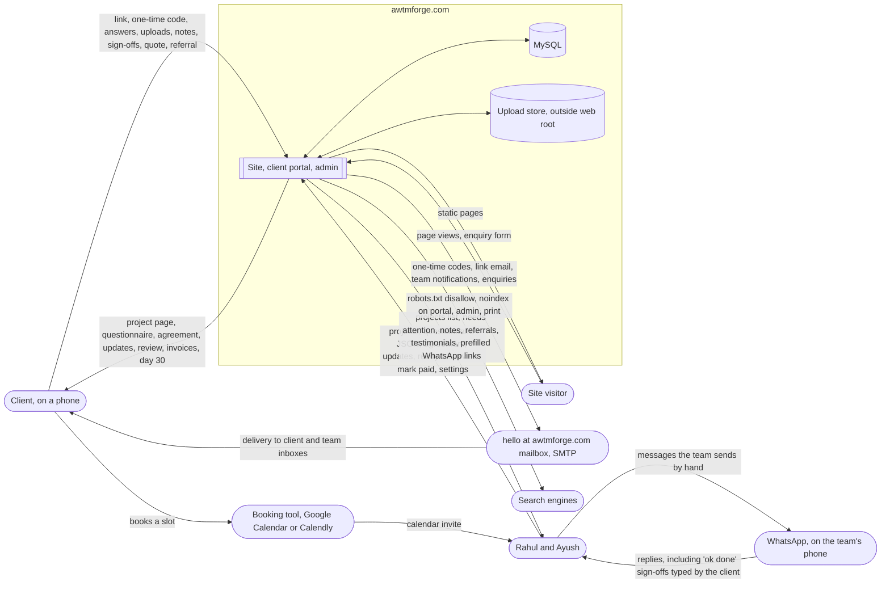

# Data flow diagrams

Drafted 7 Sep 2026, last checked against the code on 7 Sep 2026 after step 5. From PORTAL-SPEC v2, INTAKE-SPEC v2 and CLAUDE.md §5. The build session keeps these true: any step that adds a process, a store or a flow updates this file in the same commit. Diagrams are Mermaid; GitHub renders them.

Notation. Rounded boxes are external entities. Rectangles are processes, numbered so the level 1 diagram can be read against the build order. Cylinders are data stores. Every arrow is data, labelled with what moves, never with an action.

## Level 0, context

The system is one Next.js application on awtmforge.com. Everything outside the dashed box is something we do not run.

What does not cross the boundary, by design: no payment data (invoices are paid by bank transfer, marked paid by hand), no client credentials for their own systems (the access section is checkboxes), no internal cost on any flow to the client, no data to a third-party form, analytics or chat service.

## Level 1, processes

Ten processes. P1 to P8 follow the client's journey in order; P9 and P10 run across it.

```mermaid
flowchart TB
  Client([Client])
  Team([Team])
  Visitor([Visitor])
  SMTP([SMTP])

  P1[P1 Marketing site and enquiry]
  P2[P2 Client access: link and code]
  P3[P3 Intake]
  P4[P4 Agreement]
  P5[P5 Build: updates and sync]
  P6[P6 Review and delivery]
  P7[P7 Invoicing]
  P8[P8 Day 30]
  P9[P9 Admin: projects, needs attention, settings]
  P10[P10 Notifications]

  D1[(enquiry)]
  D2[(client, project, one_time_code, client_session)]
  D12[(admin setup links)]
  D3[(intake, intake_file, image_library)]
  D4[(agreement, agreement_note)]
  D5[(signoff_event)]
  D6[(update)]
  D7[(review_round)]
  D8[(invoice, invoice_sequence)]
  D9[(day30, testimonial, referral)]
  D10[(company, setting, admin_user, admin_session)]
  D11[(activity_event)]

  Visitor -- "enquiry" --> P1 --> D1
  P1 -- "enquiry received" --> P10

  Team -- "new project, contact, sign-off person" --> P9
  P9 -- "project, token hash" --> D2
  P9 -- "project created, link to email" --> P10
  P10 -- "the link, once, to the sign-off person" --> SMTP
  P9 -- "setup link hash" --> D12

  Client -- "link, code" --> P2
  P2 -- "code request, attempts, session" --> D2
  P2 -- "six-digit code" --> P10

  Client -- "answers, uploads, image choices" --> P3
  P3 --> D3
  Team -- "questionnaire JSON" --> P9 --> D3
  P3 -- "intake submitted" --> P10
  P3 -- "phase: agreement_draft" --> D2

  Team -- "scope, deliverables, dates, price, split, internal cost" --> P4
  P4 -- "agreement, versions, notes" --> D4
  Client -- "something is off, or I agree with a fresh code" --> P4
  P4 -- "agreement sign-off" --> D5
  P4 -- "phase: agreement_sent, agreement_draft, agreed" --> D2
  P4 -- "agreed" --> P7
  P4 -- "note or agreed" --> P10

  Team -- "weekly update, kickoff done" --> P5 --> D6
  P5 -- "phase: building" --> D2
  P5 -- "update sent" --> P10

  Team -- "ready for review, staging link" --> P6
  Client -- "what is off, or sign off with a fresh code, then quote and referral" --> P6
  P6 -- "rounds" --> D7
  P6 -- "delivery sign-off" --> D5
  P6 -- "day30 row, delivery quote, referral" --> D9
  P6 -- "phase: in_review, building, delivered" --> D2
  P6 -- "delivered" --> P7
  P6 -- "changes requested, delivered, thanks sent" --> P10

  P7 -- "next number in FY, invoice" --> D8
  Team -- "mark paid, reference" --> P7
  P7 -- "invoice issued" --> P10

  Client -- "metric now, approved quote, permissions" --> P8
  P8 --> D9
  P8 -- "day 30 approved" --> P10

  P9 -- "reads everything" --> D2
  P9 --> D10
  P9 -- "phase: closed, cancelled" --> D2

  P10 -- "every event" --> D11
  P10 -- "emails" --> SMTP
  P10 -- "prefilled WhatsApp links, needs attention" --> Team
```

## Flows that carry money, and where they stop

Only two flows create an invoice and both start from a `signoff_event`: P4 on `agreement` creates the advance, P6 on `delivery` creates the balance. P7 never receives a "create invoice" instruction from the team for those two kinds; the only hand-raised kind is `other`. `internal_cost_paise` enters at P4 from the team and is stored in D4; the serializer in P4, P6, P7 and P10 strips it before anything reaches the client, the print routes or a WhatsApp template. Acceptance criterion 8 tests that boundary.

## Flows that carry personal data of someone who is not the client

One: the referral name and contact from P6 into D9. It goes to P9 for the team and nowhere else, and admin can delete it (CLAUDE.md §5.1).

## Level 2, where it is worth drawing

Two processes have internal structure the build has to get right. Both are drawn as sequences in `SEQUENCES.md`: P2 (link and code, sessions, rate limits) and P7 (numbering inside one transaction, concurrency). The others are one write and one notification each.
