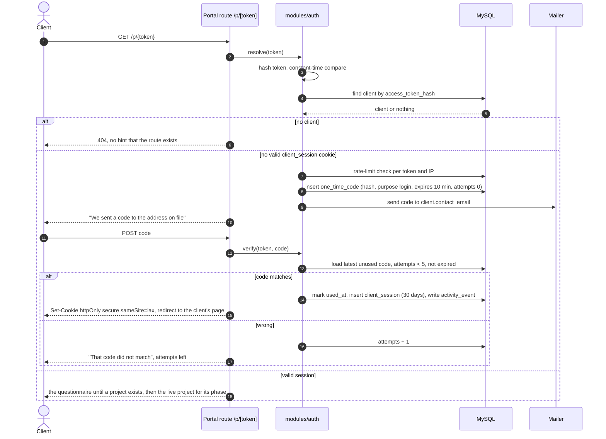
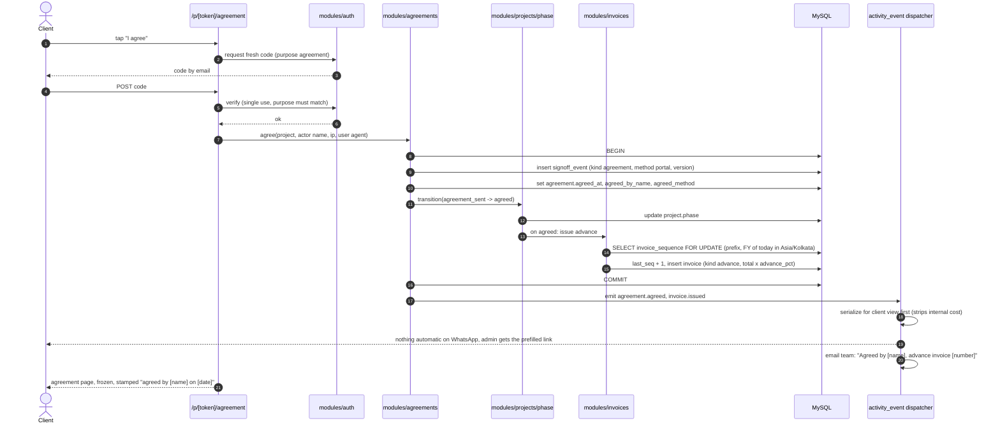
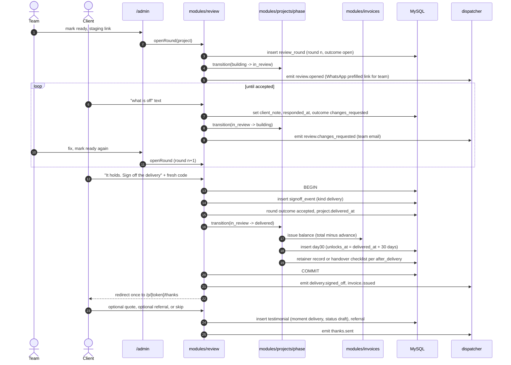
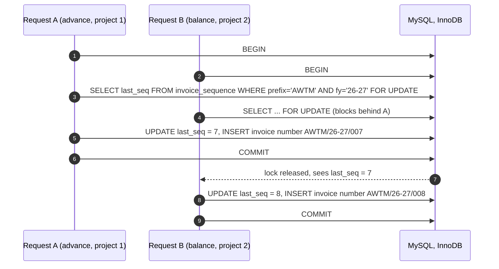

# Sequences

Drafted 7 Sep 2026, diagram 1 redrawn 10 Sep 2026. The four interactions where ordering matters. Each diagram is the contract the tests check; if the code does it in a different order, the code is wrong.

## 1. First visit: link and one-time code (the link is the client's, ADR 0015)

Rules made visible here: the token is never stored, only its hash; a wrong token and a missing client look identical from outside; the code is single use and dies after five attempts or ten minutes; a valid session lets the client view, never sign.

## 2. Agreement sign-off, advance invoice, notification

If anything between BEGIN and COMMIT fails, nothing is written: no sign-off without an invoice, no invoice without a sign-off, no number consumed without an invoice.

## 3. Review loop and delivery

Every round is kept. Nothing on the review page can delete or edit an earlier round.

## 4. Invoice numbering under concurrency

The financial year is computed once, in Asia/Kolkata, from the issuing moment; 1 April starts a new `(prefix, fy)` row at 0, so the first invoice of the year is 001. A rolled-back transaction leaves `last_seq` untouched, which is what makes "never skipped" true. The test issues twenty invoices in parallel and asserts twenty consecutive numbers.
